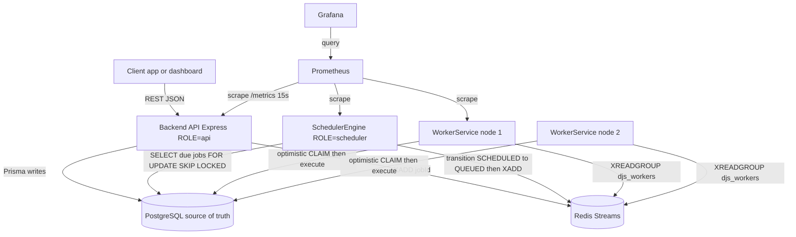
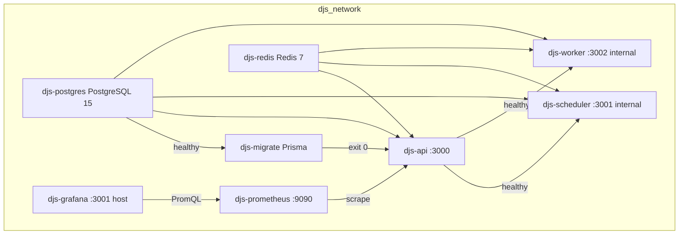
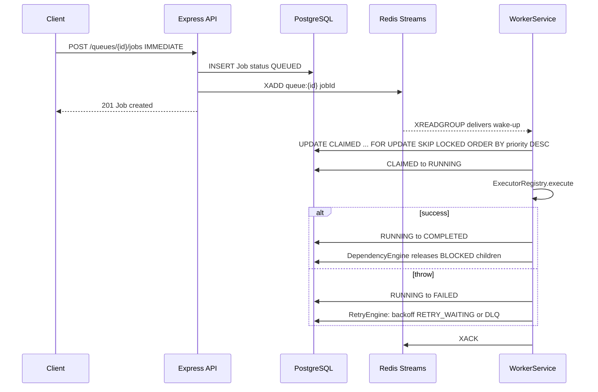
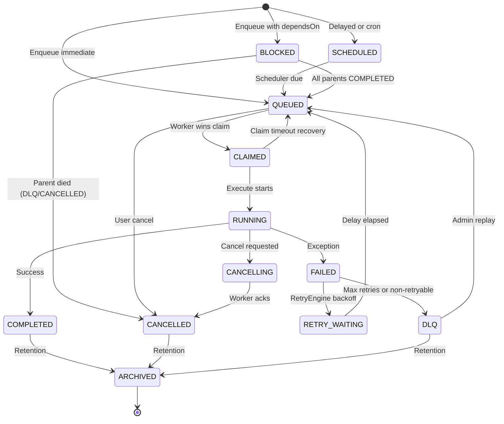
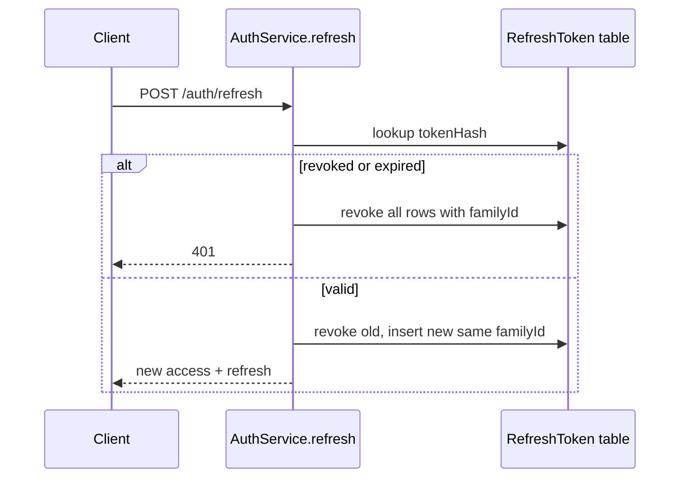
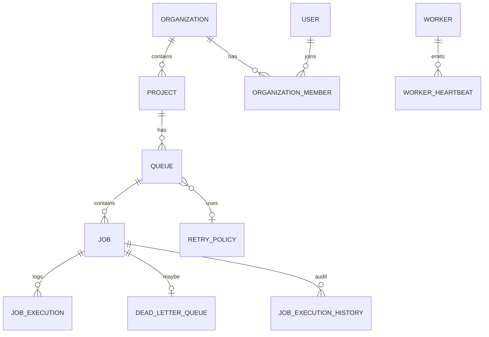

# Distributed Job Scheduler — Interview Study Guide

This is the file you study from. It is not a wiki dump and not a canvas. Every term is defined the first time it appears. After that, the same term is used the same way an interviewer expects you to use it.

**Spoken version.** `docs/INTERVIEW_SPEECH.md` is the same facts in interview order — what you say out loud, including wiki vs code.

**How to read this.** Read Parts 0–4 in order once. That is the product. Then read Part 5 (claiming) and Part 7 (failure) twice. Those two parts are where interviews go deep. Parts 8–12 exist so you are not blank if they ask about API layers, auth, indexes, or Grafana. Part 13 is a question bank. Answer out loud.

**Wiki vs this file.** `docs/deepwiki-export/` is high-level generated docs. Architecture docs (`docs/architecture/HLD_LLD.md`, `docs/INTERVIEW_GUIDE.md`) describe the *intended* design. This file also tells you what the *code actually does*. Interviewers reward that difference. Memorize it.

**One-sentence pitch you can say in 20 seconds.**

> This is a background job platform. Client apps dump work they should not do inside an HTTP request — emails, PDFs, cron, retries. PostgreSQL is the source of truth for job state. Redis Streams wake workers. A separate scheduler promotes delayed and cron jobs. Workers execute. The dashboard is an ops UI, not the engine.

---

## Table of contents

0. [What problem this solves](#part-0-what-problem-this-solves)
1. [Every technology, from zero](#part-1-every-technology-from-zero)
2. [The four processes and two stores](#part-2-the-four-processes-and-two-stores)
3. [High-level architecture and how it scales](#part-3-high-level-architecture-and-how-it-scales)
4. [Design decisions (ADRs) with full why](#part-4-design-decisions-adrs-with-full-why)
5. [How a job is claimed without two workers doing the same work](#part-5-how-a-job-is-claimed-without-two-workers-doing-the-same-work)
6. [Scheduler engine](#part-6-scheduler-engine)
7. [State machine, retries, DLQ, recovery](#part-7-state-machine-retries-dlq-recovery)
8. [Backend API](#part-8-backend-api)
9. [Authentication and authorization](#part-9-authentication-and-authorization)
10. [Data layer, Prisma schema, indexes](#part-10-data-layer-prisma-schema-indexes)
11. [Operations dashboard](#part-11-operations-dashboard)
12. [Observability, tests, CI/CD](#part-12-observability-tests-cicd)
13. [Interview question bank](#part-13-interview-question-bank)
14. [Glossary](#part-14-glossary)

---

## Part 0 — What problem this solves

### What is a background job?

Imagine you tap “Send invoice” on a website. The website could generate a PDF, email it, and only then reply “done.” That HTTP request would sit open for seconds. Users hate waiting. The server that answers HTTP also hates doing slow work: if 1,000 users click at once, the web process is busy rendering PDFs instead of answering pages.

A **background job** is a piece of work recorded as data (“send this email to this address”) and executed later by a different process. The HTTP request only *records* the work and returns immediately. Another machine, called a **worker**, picks it up and does the slow part.

That is the entire product category: **queue + workers**. This repo is that category, built as a multi-tenant SaaS (many companies share the same deployment, isolated by organization and project).

### What “distributed” means here

**Distributed** means more than one machine cooperates. You do not run one worker on one laptop. You run many worker processes, possibly on many servers. They all look at the same pool of jobs. The hard problem is: **two workers must never execute the same job**. If they did, the customer would get two emails, two charges, two webhooks.

That single constraint drives almost every design choice in this repo: PostgreSQL row locks, Redis consumer groups, optimistic status updates, heartbeats, recovery sweeps.

### What this product is not

It is not the app that *sends* real emails in production. Built-in executors (`email`, `pdf`, `webhook`, …) are **simulators** with `setTimeout`. Interviewers do not care. The platform is the interesting part: enqueue, claim, execute, retry, dead-letter, recover crashed workers, auth, multi-tenancy, metrics.

The Next.js dashboard is an **operations console**. Operators watch queues, inspect jobs, pause queues, look at workers. It does not schedule jobs itself.

### Mental model: restaurant

| Restaurant | This system |
| --- | --- |
| Customer places order | Client calls `POST /queues/{id}/jobs` |
| Ticket printed in kitchen | Row inserted into PostgreSQL `Job` table |
| Bell rings in kitchen | Redis Stream `XADD` wakes a worker |
| One cook grabs one ticket | One worker claims one job |
| Cook is cooking | Job status `RUNNING`, heartbeats tick |
| Cook collapses | Recovery engine sees stale heartbeat, requeues or fails the job |
| Dish is inedible after N retries | Dead Letter Queue (DLQ) — a holding area for poison work |
| Manager dashboard | Next.js ops UI |

You can tell this analogy in 30 seconds, then drop into the real components.

---

## Part 1 — Every technology, from zero

Interviewers assume you know these words. If you only memorized class names, you freeze. Learn each technology as a *tool with a job*.

### Node.js

**What it is.** A runtime that runs JavaScript (and TypeScript compiled to JavaScript) on a server, not in a browser. Built around an **event loop**: one main thread waits for I/O (network, disk, Redis, Postgres) and fires callbacks when data arrives.

**Why it fits this project.** Job schedulers spend most of their time waiting: waiting for Redis messages, waiting for SQL, waiting for HTTP. Node is good at many concurrent waits on one process. CPU-heavy PDF rendering would be a worse fit; that is why those executors are mocks.

**What to say.** “API, scheduler, and workers are Node processes. We scale by running more processes, not by making one process multithreaded.”

### TypeScript

JavaScript plus static types. Catches “this field does not exist” at compile time. Shared types live in `shared/` so frontend, API, and workers agree on the shape of a job payload.

### Express.js

A **minimal HTTP framework** for Node. You write functions: “when `POST /api/v1/jobs` arrives, run this.” Express does not force a structure. This repo adds its own layers: routes → controllers → services → repositories.

**Why not NestJS?** NestJS is a bigger framework with its own dependency-injection container (a system that constructs objects for you). ADR 003: Express keeps the stack thin and the control flow visible. For a high-throughput API, fewer magic layers means easier debugging. Tradeoff: you write more boilerplate yourself.

### Next.js and React

**React** is a library for building UIs as components (functions that return HTML-like trees). **Next.js** is a React framework: routing, bundling, server rendering.

This dashboard uses the **App Router** (`frontend/src/app/…`). Pages are files. A layout wraps sidebar + topbar around every ops page.

**React Query (TanStack Query)** is a client cache for HTTP. Instead of every button fetching by hand, hooks like `useJobs()` fetch, cache, and refetch.

**Tailwind CSS** is a utility CSS system (`className="flex gap-2"`). **Recharts** draws charts. **Axios** is the HTTP client.

**Important frontend design choice.** The dashboard talks to the *same* REST API and the *same* `/metrics` Prometheus text that Grafana uses. It does not invent a private BFF (backend-for-frontend). Prometheus text is parsed in the browser (`metrics-parser.ts`). If `/metrics` is down, metric widgets fail; job lists still work. That is **graceful degradation**.

### PostgreSQL (Postgres)

**What it is.** A **relational database**. Data lives in tables with columns and types. Rows are related by foreign keys (a job’s `queueId` must point at a real queue). You query with SQL.

**ACID** — four guarantees of a transaction (a group of SQL statements that succeed or fail together):

| Letter | Meaning | Why jobs need it |
| --- | --- | --- |
| **A**tomicity | All statements commit, or none do | You never leave a job `CLAIMED` without a history row if both writes are in one transaction |
| **C**onsistency | Constraints hold (unique emails, valid enums) | A job cannot have a status that is not in `JobStatus` |
| **I**solation | Concurrent transactions do not trample each other | Two workers cannot both think they own the same row if locking is used correctly |
| **D**urability | After commit, a crash does not erase the write | Job state survives process death |

**Row-level lock.** When a transaction does `SELECT … FOR UPDATE` on a row, other transactions that want to lock that same row **wait**. `SKIP LOCKED` changes the wait into a skip: “if this row is already locked, pretend it is not there and take the next one.” That is how many processes pick distinct jobs without a coordinator process.

Postgres is the **source of truth**. If Redis dies and restarts empty, jobs still exist in Postgres. Redis can be rebuilt. Postgres cannot be treated as optional cache.

### Redis

**What it is.** An in-memory data store. Data lives in RAM, so reads/writes are microseconds, not milliseconds. Persistence to disk is optional and weaker than Postgres. Redis is used as:

1. **Message bus** — Redis **Streams** (explained in Part 5).
2. **Coordination** — intended for **Redlock** (distributed lock algorithm: several Redis keys, majority vote, so two scheduler replicas do not double-fire). In *this* codebase the Redlock call is a comment, not live code. Say that honestly.
3. **Fast counters / rate limits** — Redis is the natural place for hot counters if we add API rate limiting.

**Redis vs Postgres in one line.** Postgres remembers the truth. Redis shouts “work is ready” so workers are not hammering Postgres with `SELECT` every 10 ms.

### Redis Streams (the data structure)

A **stream** is an append-only log. Each entry has an ID and fields, like `{ jobId: "abc-…" }`.

Commands you should be able to name:

| Command | What it does |
| --- | --- |
| `XADD queue:{queueId} * jobId <id>` | Append a wake-up event |
| `XGROUP CREATE … MKSTREAM` | Create a **consumer group** on that stream |
| `XREADGROUP GROUP djs_workers <workerId> … STREAMS queue:{id} >` | This worker reads *new* messages assigned to the group |
| `XACK` | “I finished this message; do not redeliver it to me” |

A **consumer group** (`djs_workers` in this repo) is a named team of consumers. Redis gives each message to **one** member of the group. That is load balancing at the notification layer. It is **not** the final claim of the job. The job is only owned after Postgres status becomes `CLAIMED`.

The special ID `>` means “give me messages never delivered to this group yet.”

### Prisma

**What it is.** An **ORM** (Object-Relational Mapper). You describe tables in `database/prisma/schema.prisma` in a schema language. Prisma generates:

- SQL **migrations** (files under `database/prisma/migrations/`)
- A TypeScript **client** (`prisma.job.findMany(…)`) so queries are typed

**Why not TypeORM?** ADR 004: Prisma’s schema-first client is harder to get wrong than decorator-based entities. Tradeoff: complex SQL (like `FOR UPDATE SKIP LOCKED`) still needs `$queryRaw`.

**Migration.** A versioned SQL change. `prisma migrate deploy` applies new files. Docker runs a one-shot `djs-migrate` container before API/worker start.

**Seed.** `database/prisma/seed.ts` wipes demo data and inserts Alice/Bob, Acme/Globex, queues, sample jobs. Local only.

### Zod

A **runtime schema** library. TypeScript types disappear at runtime. Zod still checks “password has 8 chars and a number” on the actual HTTP body. Shared Zod schemas live in `shared/` so the API and (in principle) the frontend validate the same shape.

### JWT (JSON Web Token)

A small signed string. Three base64 parts: header, payload, signature. Payload here includes `userId`, `sessionId`, `tokenVersion`. Signature proves the API minted it (`JWT_SECRET`). Access tokens live ~15 minutes. Refresh tokens are longer-lived random strings stored **hashed** in Postgres.

### bcrypt vs SHA-256 (hashing)

A **hash** is a one-way function: password → `passwordHash`. You cannot reverse it. Login hashes the typed password and compares.

- **bcrypt** is *slow on purpose* (salt + many rounds). Used for **user passwords**. Slow is good: attackers cannot try billions of guesses per second.
- **SHA-256** is fast. Used for **API keys**, **refresh tokens**, **email-verify tokens**. Those are already high-entropy random bytes, so slow hashing is less necessary. Lookup by hash must be fast.

`docs/INTERVIEW_GUIDE.md` says API keys are bcrypt. **That doc is wrong.** Code hashes API keys with SHA-256 (`ApiKeyService`). In interview, say SHA-256 for keys, bcrypt for passwords.

### Docker and Docker Compose

**Docker** packages an app plus its OS libraries into an **image**, then runs it as a **container**.

**Docker Compose** starts many containers as one stack: Postgres, Redis, migrate, API, scheduler, worker, Prometheus, Grafana. `ROLE` env var picks which Node entrypoint runs inside the same backend image (`api` / `scheduler` / `worker` / `migrate`).

That is a scalability trick: **one image, many roles**. You scale workers by `docker compose up --scale worker=8`, not by building eight different images.

### Prometheus and Grafana

**Prometheus** scrapes HTTP `/metrics` every 15s and stores time series (`djs_queue_depth`, `djs_worker_jobs_failed_total`, …).

**Grafana** graphs those series and shows alerts.

**prom-client** is the Node library that *exposes* those metrics.

### k6

A load-testing tool. Scripts in `backend/test/load/` pretend to be many users (VUs = virtual users). Smoke / API / enqueue / worker / spike / stress / soak.

### pnpm/npm workspaces (monorepo)

One git repo, many packages (`backend`, `frontend`, `worker`, `scheduler`, `shared`, `database`). `shared` is linked as `file:../shared`. Types do not drift.

---

## Part 2 — The four processes and two stores

### Layout on disk

| Directory | Role | Runs as |
| --- | --- | --- |
| `backend/` | Express REST API, and also the *source* of `WorkerService` / `SchedulerEngine` | Process `ROLE=api` |
| `worker/` | Thin package; execution logic is `backend/src/worker.ts` + `WorkerService` | Process `ROLE=worker` |
| `scheduler/` | Thin package; logic is `backend/src/scheduler.ts` + `SchedulerEngine` | Process `ROLE=scheduler` |
| `frontend/` | Next.js ops dashboard | Separate Node/Next process |
| `shared/` | Types, Zod, response envelopes | Library, not a process |
| `database/` | Prisma schema + migrations + seed | Used at migrate/start |
| `monitoring/` | Prometheus + Grafana config | Two containers |

Worker and scheduler packages exist so you can deploy them as **separate artifacts** even though they share backend source. Interview phrase: **modular monorepo, independently deployable processes**.

### System topology



**Follow the arrows.** The client never talks to workers. Workers never serve HTTP for job enqueue. Grafana never writes jobs.

### Two stores, one rule

| Store | Holds | If it dies |
| --- | --- | --- |
| PostgreSQL | Users, orgs, queues, job rows, status, history, DLQ, sessions | Product is down. This is not optional. |
| Redis | Wake-up stream entries, intended locks/rate limits | Workers go quiet until streams are republished. Jobs are **not** lost: the slow sweep republishes `QUEUED` drift, and `XAUTOCLAIM` recovers crashed consumers' pending entries. |

**Say this sentence:** “Postgres is durable state. Redis is the pager that wakes workers.”

---

## Part 3 — High-level architecture and how it scales

HLD = High-Level Design: boxes and arrows, scale story, failure story. LLD = Low-Level Design: the SQL, the state machine, the exact claim path.

### SRS numbers (what “scale” means on paper)

From `docs/architecture/SRS.md`:

- API p95 under **200 ms**
- Claim latency under **100 ms**
- **10,000+** queued jobs
- **1,000** job submissions per minute
- **100+** concurrent workers
- Exactly-once *intent* via atomic transitions (practically: at-least-once execution with idempotent handlers — see Part 5)

k6 results (`backend/test/load/PERFORMANCE_REPORT.md`): smoke p95 ~69 ms; soak-short 50 VUs p95 ~43 ms; stress to 1200 VUs p95 ~3 s and ~1% errors past ~800 VUs. Full 60-minute soak is marked TBD.

### What scales independently (the whole point of splitting processes)

| Load increases | What you add | Why it works |
| --- | --- | --- |
| More HTTP clients, more dashboard users | More **API** replicas behind a load balancer | API is **stateless**. Session truth is in Postgres. Any replica can verify JWT. |
| More delayed/cron jobs becoming due | More **scheduler** replicas *or* a bigger tick batch | Due-row claim uses `FOR UPDATE SKIP LOCKED`, so two schedulers do not promote the same row. Leader lock (Redlock) is documented, not implemented. |
| More jobs to *execute* | More **worker** replicas | Consumer group + Postgres claim. CPU/RAM bound. This is the main horizontal scale knob. |
| More job *rows*, more history | Postgres vertical (bigger instance) then read replicas for dashboard reads | Claiming needs the primary. Dashboards can eventually read replicas. |
| More wake-up traffic | Redis memory + Redis Cluster later | Streams are small (`jobId` only). Payload lives in Postgres. That is why Redis stays cheap. |

**Stateless** means the process does not keep “the only copy” of user/job state in RAM. You can kill an API pod; the next pod serves the next request. Workers *do* have in-memory `activeJobs` and heartbeats, but the **job row** is in Postgres. If a worker dies, recovery uses that row.

### Why not one giant Node process?

If API + scheduler + workers share one process:

- A slow PDF job blocks the event loop → HTTP p99 explodes → cron fires late.
- You cannot scale workers without also scaling API.
- A deploy that restarts HTTP also restarts in-flight jobs unless you drain carefully.

Celery (Python) split **Beat** (the clock) from **workers** for the same reason. This repo copies that pattern (`docs/INTERVIEW_GUIDE.md`).

### Docker dependency graph (local HLD)



Health probes: `GET /health/live` (process up) vs `GET /health/ready` (Postgres + Redis reachable). Kubernetes uses live/ready to restart vs stop sending traffic.

### Multi-tenancy (how many companies share one cluster)

```
Organization  (Acme Corp)
  └── Project  (E-commerce Backend, env=PRODUCTION)
        └── Queue  (email-sending, concurrency, retry policy)
              └── Job  (payload JSON, status, retries)
```

Isolation is **data isolation**, not separate databases per tenant (in v1). Every query is scoped by org/project. RBAC + API key scopes enforce it. Scaling tenants is “more rows + indexes,” not “more microservices.”

If an interviewer asks “noisy neighbor?”: one tenant flooding a queue is contained by **per-queue concurrency**, **rateLimit** on `QueueConfiguration`, and worker `maxConcurrency`. You can also put a huge tenant on a dedicated queue and dedicated worker pool (`supportedQueues` on the worker record).

---

## Part 4 — Design decisions (ADRs) with full why

ADRs live in `docs/adrs/0001-architecture-decisions.md`. Do not recite “we chose X.” Recite **problem → options → pick → tradeoff → how we scale with that pick**.

### ADR 001 — PostgreSQL over MongoDB

**Problem.** Jobs have a strict lifecycle. Queues belong to projects belong to orgs. You need transactions and locks.

**MongoDB** stores JSON documents. Great for flexible shapes. Weak at: multi-document transactions historically, and **no** `FOR UPDATE SKIP LOCKED`. You would invent a lock collection, compare-and-set on a `lockedBy` field, and still lose races under load.

**Postgres** gives ACID, foreign keys, enums (`JobStatus`), and skip-locked. Relational shape matches the domain: User → Org → Project → Queue → Job → Execution.

**Scale tradeoff.** Postgres primary is a write bottleneck. Mitigation: keep Redis as the hot path for *notification*; keep job payloads reasonable (`maxPayloadSize` 1 MB); index `(queueId, status, nextRunAt)`; archive old jobs (`ARCHIVED`, retention days).

**What to say.** “A job scheduler is a state machine over rows. That is a relational, transactional problem, not a document problem.”

### ADR 002 — Redis Streams over RabbitMQ

**Problem.** Workers must not poll Postgres in a tight loop (that is called a **thundering herd** of `SELECT`s). You need a broker.

**RabbitMQ** is a dedicated message broker: exchanges, queues, acks, dead letters. Excellent. Cost: another cluster, another failure domain, another skill set.

**Redis Streams** give consumer groups and acks (`XACK`) while you already run Redis for locks and counters.

**Scale tradeoff.** RabbitMQ routing is richer (topic exchanges). Streams are simpler: one stream per queue, `queue:{queueId}`. Payload is **not** in the stream — only `jobId`. That keeps Redis memory flat as jobs grow.

**What to say.** “Streams are the doorbell. Postgres is the ticket. We did not put the PDF bytes in Redis.”

### ADR 003 — Express over NestJS

Already covered. Extra interview point: Clean Architecture here means **HTTP adapters are thin**. Controllers extract params, services own rules, repositories own SQL/Prisma. You can test `RetryEngine` without Express (`backend/test/integration/retry.test.ts`).

### ADR 004 — Prisma over TypeORM

Schema file is the contract. Generated client matches it. `$queryRaw` for skip-locked. Transaction helper `runInTransaction` in `backend/src/database/db.ts` wraps `prisma.$transaction` with timeout and isolation level.

### ADR 005 — Modular monorepo over microservices

**Microservices** would mean: separate git repos, API gateway, service discovery, distributed tracing as a *requirement* on day one, versioning between “job service” and “auth service.”

This product’s four runtimes **share the job state machine**. Splitting them into networked microservices would turn every transition into an HTTP/gRPC call. You would still need a shared DB or a saga. That is overhead without benefit at this stage.

**Monorepo** = one repo. **Modular** = packages with boundaries. **Independent deploy** = different Docker `ROLE`s / replicas.

**Scale path if you outgrow this.** First scale workers. Then split read-heavy dashboard queries to replicas. Only then extract a service (for example, a dedicated auth service) if a team owns it. Do not start there.

### ADR 006 — Redis for distributed coordination

Intended uses: Redlock around scheduler ticks; atomic rate limit tokens.

**Honesty in interview.** `SchedulerEngine.processScheduledJobs` has a comment: “we’d acquire a Redlock here.” Safety net that *is* implemented: `FOR UPDATE SKIP LOCKED` on due jobs. Two schedulers can tick; they still promote disjoint rows.

---

## Part 5 — How a job is claimed without two workers doing the same work

This is the interview centerpiece. Wiki and HLD **oversimplify**. Learn both layers.

### Layer A — What the HLD *draws* (design intent)

`docs/architecture/HLD_LLD.md` shows this SQL as “the worker claiming mechanism” — and it is now the actual worker claim (`JobRepository.claimNextQueuedJob`):

```sql
UPDATE "Job"
SET status = 'CLAIMED', "lockedAt" = NOW(), "lockedBy" = $1
WHERE id = (
    SELECT id FROM "Job"
    WHERE status = 'QUEUED' AND "queueId" = $2
    ORDER BY priority DESC, "createdAt" ASC
    FOR UPDATE SKIP LOCKED
    LIMIT 1
)
RETURNING *;
```

**What `FOR UPDATE SKIP LOCKED` means, from zero.**

1. Worker A and Worker B both want a `QUEUED` row.
2. `FOR UPDATE` means: lock those rows until this transaction commits.
3. Without `SKIP LOCKED`, Worker B **blocks** (waits) until A commits. Waiting workers pile up. Latency explodes.
4. With `SKIP LOCKED`, Worker B **does not wait**. It skips A’s locked row and takes the next unlocked `QUEUED` row.
5. Combined with `ORDER BY priority DESC, createdAt ASC`, high priority and older jobs go first (**priority queue + FIFO within priority**).

That pattern is a standard Postgres work-queue. Interviewers know it from Skip Locked blog posts.

### Layer B — What *this repo’s worker* actually does

Read `backend/src/services/worker.service.ts` and `job.repository.ts`.

1. Worker registers itself (`worker.upsert`, status `ONLINE`), starts a 10s worker heartbeat, listens for `SIGTERM`.
2. Loop: list queue IDs, ensure stream `queue:{id}` has group `djs_workers` (`XGROUP CREATE … MKSTREAM`; ignore `BUSYGROUP`).
3. `XAUTOCLAIM` each queue stream: steal pending entries idle > 30s — wake-ups a crashed consumer read but never acked.
4. `XREADGROUP GROUP djs_workers <this.workerId> COUNT 1 BLOCK 2000 STREAMS … >`
   Redis assigns **one stream message** to this consumer.
5. **The message is only a wake-up signal.** The worker ignores its `jobId` and runs `JobRepository.claimNextQueuedJob` — the single-statement skip-locked picker from Layer A. It claims the highest-priority `QUEUED` row, whichever one that is.
6. If the claim returns nothing (queue already drained — another worker beat the signal), `XACK` and move on. If it wins: write a `QUEUED → CLAIMED` history row, `CLAIMED → RUNNING`, run `ExecutorRegistry.get(taskType).execute(payload)`, then `RUNNING → COMPLETED` or `RUNNING → FAILED`.
7. Job heartbeat every 5s updates `Job.lastHeartbeat`.
8. `finally`: `XACK` the stream message.

This design makes the stream **advisory**: duplicates, redeliveries, and republished signals can never double-claim, because the DB claim — not the message — decides which job runs. It also makes priority strict: the picker orders by `priority DESC, createdAt ASC` regardless of signal order.

### Layer C — The scheduler uses the same primitive in batch form

`SchedulerEngine.processScheduledJobs` (`backend/src/services/scheduler.engine.ts`) selects up to 1000 due `SCHEDULED`/`RETRY_WAITING` rows `FOR UPDATE SKIP LOCKED` **inside a real transaction** — in autocommit the locks would release when the SELECT returns. Each row promotes `→ QUEUED`, then `XADD queue:{queueId}` after commit.

### Why both? (the answer that sounds senior)

| Mechanism | Protects against | Cheap? |
| --- | --- | --- |
| Redis consumer group + `XAUTOCLAIM` | Wake-up delivery + reclaiming crashed consumers' pending entries | Very. In-memory. |
| SKIP LOCKED claim (worker) | Every claim race — redelivery, duplicates, sweeper vs worker; gives strict priority | One indexed UPDATE |
| SKIP LOCKED on scheduler | Two scheduler replicas promoting the same due set | Set-based, 1000 rows |

Redis is **not** the source of truth. If Redis says “wake up” but Postgres has nothing `QUEUED`, the worker shrugs and acks.

### Visibility timeout (word from the glossary)

Time a job may sit in `CLAIMED` / `RUNNING` before we assume the worker died. Each queue's `QueueConfiguration.claimTimeout` / `heartbeatTimeout` drives the sweeper SQL (COALESCE over schema defaults 5s/30s), so timeouts are per-queue configurable.

### Exactly-once vs at-least-once

True exactly-once in a distributed system is extremely hard (the two generals problem: the network can drop the “I finished” message).

This system is **at-least-once with a single-winner claim**:

- A job should only be `RUNNING` on one worker at a time (optimistic claim).
- After a crash, recovery may **run it again**. Executors should be **idempotent** (running twice does not double-charge). The `CustomExecutor` can throw on `payload.shouldFail` to test retries — it is not a real payment API.

**Say:** “We guarantee at most one *concurrent* execution. We do not promise the handler never runs twice across a crash. Handlers must be idempotent.”

### Priority

HLD orders `priority DESC, createdAt ASC`, and the worker claim query now does exactly that. Redis Stream entries are **wake-up signals, not job assignments** — the worker ignores which jobId the message names and runs the skip-locked picker, so strict global priority within a queue is real. A stale signal for a low-priority job still triggers a claim of the highest-priority queued row.

`XAUTOCLAIM` also runs each poll tick: pending stream entries idle over 30s (abandoned by a crashed consumer) are reclaimed and treated as fresh wake-ups.

### Sequence: immediate job (happy path)



---

## Part 6 — Scheduler engine

### Why a clock process exists

Immediate jobs: API writes `QUEUED` + `XADD`. No clock needed.

**Delayed** jobs: “run in 10 minutes.” **Cron** jobs: “every day at 09:00.” Those rows sit in `SCHEDULED` with `nextRunAt` in the future. Somebody must notice `nextRunAt <= NOW()`.

That somebody is `startScheduler()` in `backend/src/scheduler.ts`: every **5 seconds**, `processScheduledJobs()`.

If this loop lived inside the API process, a traffic spike (or a blocked event loop) would delay cron. Separate process = isolated event loop, isolated deploy, isolated horizontal scale.

### Tick internals

1. Loop batches of `batchSize` 1000 (avoid locking millions of rows in one transaction).
2. Skip-locked SELECT of due `SCHEDULED` rows.
3. Empty batch → stop.
4. For each row (in parallel `Promise.all`): state machine `SCHEDULED → QUEUED`, then `XADD`.
5. Repeat while rows remain.

**Cron expressions.** The wiki says the scheduler “evaluates cron.” The `ScheduledJob` model stores `cronExpression`. The engine you read promotes `Job` rows that already have `nextRunAt` set. In interview: “due jobs are those with `nextRunAt <= now`. Recurrence is stored on scheduled-job records; the tick promotes due `Job` rows.” Do not pretend you parse cron in `processScheduledJobs` unless you have read that path.

### Metrics

`djs_scheduler_ticks_total`, `djs_scheduler_tick_duration_seconds`, `djs_scheduled_jobs_processed_total`, `djs_scheduled_jobs_failed_total`.

### HA schedulers

- Implemented: skip-locked disjoint batches.
- Documented / TODO: Redlock so only one tick runs (reduces duplicate work even if skip-locked makes it safe).
- `SchedulerLock` table exists in Prisma for DB-side locks as another option.

---

## Part 7 — State machine, retries, DLQ, recovery

### Why a state machine

If any function could `UPDATE status` to anything, you get nonsense: `COMPLETED → RUNNING`, or two workers both completing. `AllowedTransitions` in `job-state-machine.engine.ts` is a **DAG** (directed graph, no cycles except the documented retry/replay edges). Illegal edges throw before SQL.

Every successful transition also inserts `JobExecutionHistory` (previous, next, actor, reason). That is the audit trail the jobs UI shows.



Allowed matrix (from code):

| From | To |
| --- | --- |
| QUEUED | CLAIMED, CANCELLED |
| SCHEDULED | QUEUED, CANCELLED |
| BLOCKED | QUEUED, CANCELLED |
| CLAIMED | RUNNING, QUEUED |
| RUNNING | COMPLETED, FAILED, CANCELLING |
| CANCELLING | CANCELLED |
| CANCELLED | ARCHIVED |
| COMPLETED | ARCHIVED |
| FAILED | RETRY_WAITING, DLQ |
| RETRY_WAITING | QUEUED, CANCELLED |
| DLQ | ARCHIVED, QUEUED |
| ARCHIVED | *(none)* |

### Retry engine

On failure, `RetryEngine.evaluateFailedJob(jobId, errorCode, message)`:

1. Load job + queue + `RetryPolicy`.
2. If no policy, or `retryCount >= maxRetries` or `>= policy.maxAttempts` → **DLQ** reason `MAX_RETRIES_EXCEEDED`.
3. If `retryOnErrorCodes` is non-empty and this code is not in the list → **DLQ** `NON_RETRYABLE_ERROR`. Empty list = retry all codes.
4. Else compute `nextRunAt`, increment `retryCount`, `FAILED → RETRY_WAITING`.

**Backoff** (`calculateNextRunAt`):

| Strategy | Formula |
| --- | --- |
| FIXED_DELAY | `delay = initialDelayMs` |
| LINEAR_BACKOFF | `delay = initialDelayMs * (attempt + 1)` |
| EXPONENTIAL_BACKOFF | `delay = initialDelayMs * multiplier^attempt` |
| Cap | `min(delay, maxDelayMs)` |
| Jitter | if enabled, add random in `± jitterPercentage * delay` |

**Jitter** exists so 10,000 jobs that fail together do not all retry at the same millisecond (**retry storm**). Interviewers love jitter.

Who moves `RETRY_WAITING → QUEUED`? Same idea as delayed jobs: `nextRunAt` in the future. Scheduler / a retry sweep should promote them. Know that `RETRY_WAITING` is a legal source of `QUEUED`.

### Dead Letter Queue (say this in interviews)

**What problem exists without a DLQ.**

A worker runs a job. The job throws. You retry. It throws again. Forever.

That is not “the queue is busy.” That is **one bad unit of work** that will never succeed. Industry name: **poison pill** (or poison message). Examples:

- Payload JSON missing `to` for an email job. Executor always throws `VALIDATION`.
- Bug in PDF executor. Every payload of that shape crashes.
- Downstream API returns `400 Bad Request` (client error). Retrying 400 does not help. The request is wrong.

If you keep that job in `QUEUED` / Redis stream:

- Workers keep claiming it, failing, putting it back. CPU wasted.
- If you used a **blocking** queue (FIFO, no skip): one poison job at the head can stall everything behind it. This project’s workers skip via Redis consumer groups + optimistic claim, so it does **not** stall the whole queue like a naive list would — but it still **burns worker slots and retry budget** and floods logs/metrics.
- Ops cannot tell “temporarily flaky network” from “this job is garbage.” Both look like `FAILED`.

A **Dead Letter Queue** is the parking lot for work you **stop retrying**. The job is still stored. It is **not eligible to be claimed**. Humans (or a later automation) inspect it.

**Classic messaging definition vs this repo.**

In Kafka / SQS / RabbitMQ, a DLQ is often a **second queue**: failed messages get published there. Consumers of the main queue never see them. Replay = copy the message back to the main queue.

This product’s source of truth is **PostgreSQL job state**, not Redis. So the DLQ is **not** a Redis Stream named `dlq`. It is:

1. The same `Job` row, `status = DLQ`. Workers only claim `QUEUED`. Scheduler only promotes `SCHEDULED` / due work. Status `DLQ` → **invisible to workers**. Isolation is a **state**, not a second broker queue.
2. A **sidecar row** `DeadLetterQueue` (1:1 with the job, `jobId` unique). The job row is the work item. The DLQ row is the **forensics file**: why we gave up, who last held the lock, how many retries, last exception, optional AI notes.

Why two records? Job table stays the lifecycle. DLQ table is queryable ops data (“show all poison jobs for queue X this week”) without stuffing huge exception JSON onto every job.

Columns that matter in an interview (`DeadLetterQueue` in `schema.prisma`):

| Field | What you say it is |
| --- | --- |
| `jobId` | Which job we parked (unique → one DLQ entry per job) |
| `queueId` / `originalQueueName` | Which queue it came from (replay must go back to a queue) |
| `originalWorkerId` | Last `lockedBy` — which worker died on it |
| `retryCount` | How many times we already tried |
| `reason` | Machine reason: `MAX_RETRIES_EXCEEDED` or `NON_RETRYABLE_ERROR` |
| `failureCategory` | Coarse bucket (`EXECUTION_ERROR` in code today) |
| `finalException` | Last error payload (JSON) |
| `recoveryRecommendation` | Hint for humans (“fix payload or code”) |
| `aiAnalysis` | Optional structured RCA (schema supports it; not required for the story) |
| `movedAt` | When we parked it |

**Exact path in the designed engine (`RetryEngine.evaluateFailedJob`).**

Worker catch path: `RUNNING → FAILED` (exception message as reason). Then **retry engine** is supposed to run:

```
FAILED job
  ├─ no RetryPolicy on queue
  │     OR job.retryCount >= job.maxRetries
  │     OR job.retryCount >= policy.maxAttempts
  │        → sendToDLQ(reason = MAX_RETRIES_EXCEEDED)
  ├─ policy.retryOnErrorCodes is non-empty AND this errorCode is not in the list
  │        → sendToDLQ(reason = NON_RETRYABLE_ERROR)
  └─ else
           increment retryCount, set nextRunAt (backoff + jitter)
           FAILED → RETRY_WAITING
```

`sendToDLQ`:

1. `FAILED → DLQ` via state machine (`actor: system:dlq-manager`). Illegal if job is not `FAILED`.
2. `INSERT DeadLetterQueue` with the forensics fields.

Two **different** “we stop retrying” stories — interviewers distinguish them:

- **Exhausted retries.** Transient errors (`NETWORK_TIMEOUT`) that never recover. You *did* retry. Budget gone. Park it. Example: SMTP down for 20 minutes, `maxAttempts = 3`, delays 1s / 2s / 4s — still failing → DLQ. (If outage lasts hours, DLQ is correct *for this attempt budget*; ops replay after SMTP is up.)
- **Non-retryable.** Retrying is **wrong**, not just exhausted. HTTP 400, schema validation, `UNAUTHORIZED`. Policy lists retryable codes (e.g. `NETWORK_TIMEOUT`, `DATABASE_TIMEOUT`). Empty `retryOnErrorCodes` = “retry everything until max.” Non-empty + unknown code = DLQ immediately, even if `retryCount` is 0.

**FAILED vs RETRY_WAITING vs DLQ** (do not mix these words):

| Status | Meaning | Will a worker run it? |
| --- | --- | --- |
| `FAILED` | Last execution threw. **Decision pending** (retry vs park). Short-lived if the engine is wired. | No |
| `RETRY_WAITING` | We will try again. Clock: `nextRunAt`. | No, until promoted to `QUEUED` |
| `DLQ` | We **will not** try again automatically. | No, until **replay** |

**Replay (the human loop).**

DLQ is not delete. It is quarantine.

Ops: read exception, fix payload or deploy a code fix, then **replay**: legal edge `DLQ → QUEUED` in `AllowedTransitions`. After that the job is claimable again. Metrics even define `djs_dlq_resolution_total` with `resolution_type` `replayed` | `discarded`. Discard/archive: `DLQ → ARCHIVED` (retention). Dashboard KPI **DLQ depth** = count of jobs sitting in that parking lot. Alert: DLQ ingest rate > 0 over 10m → something is systematically broken (bad deploy, bad producer).

**What you must admit if they ask “does the running worker do this?”**

Honesty scores points. Code today:

- `RetryEngine.sendToDLQ` exists and upserts the `DeadLetterQueue` row, so DLQ re-entry after replay cannot crash on the `jobId` unique key.
- Worker `catch` does `RUNNING → FAILED`, records the `JobExecution` row with the stack trace, then calls `evaluateFailedJob`.
- The fast sweeper also evaluates heartbeat-timeout failures and any leftover `FAILED` jobs — a crash between transition and evaluation cannot strand work.
- Replay is a real handler: `POST /api/v1/jobs/:id/replay` runs `DLQ → QUEUED` in a transaction (retry budget reset, history row), then re-`XADD`s Redis.

**30-second oral answer (memorize this):**

> A DLQ is where we put jobs we will not retry automatically — poison pills: bad payload, non-retryable errors, or retries exhausted. In this system it is not a Redis queue. Postgres status `DLQ` makes workers ignore the row, and a `DeadLetterQueue` table stores why we parked it. That protects worker capacity and lets humans inspect and replay. Retryable transients go `FAILED → RETRY_WAITING` with backoff; only the give-up path is DLQ.

### Recovery engine (crashed workers)

Workers are mortal. Kill -9 leaves jobs in `CLAIMED` or `RUNNING`.

`RecoveryEngine.executeFastSweep` (every few seconds):

1. `CLAIMED` and `lockedAt` older than the queue's `claimTimeout` (5s default) → back to `QUEUED` + fresh `XADD` (dead consumer's pending entry is never reclaimed).
2. `RUNNING` and `lastHeartbeat` older than the queue's `heartbeatTimeout` (30s default) → `FAILED` → `RetryEngine`.
3. Unevaluated `FAILED` jobs → `RetryEngine` (crash between transition and evaluation can't strand work).
4. Workers with `lastSeen` older than 30s → `OFFLINE`.

Worker process also writes `WorkerHeartbeat` every 10s (CPU, RAM, currentJobs) and `Worker.lastSeen`. Status: `ONLINE`, `DRAINING` (SIGTERM: finish in-flight, refuse new), `OFFLINE`, `TERMINATED`.

`executeSlowSweep` (every 5 min): republish `XADD` for `QUEUED` jobs idle > 5 minutes (Redis drift — dedup-safe via the claim CAS), purge metrics older than 7 days and heartbeats older than 24h, archive terminal jobs past per-queue retention (`jobRetentionDays`/`dlqRetentionDays`).

**Graceful shutdown.** `isDraining = true` stops the poll loop. Wait until `activeJobs === 0`. Then `OFFLINE`. Orchestrators (K8s) send SIGTERM, wait `terminationGracePeriodSeconds`.

### Executors

`JobExecutor { type, execute(payload) }`. `ExecutorRegistry` is a `Map`. Duplicate type throws. Missing type throws.

Built-ins (all simulated delays): `email`, `pdf`, `webhook`, `data_processing`, `system`, `custom` (can fail), `IMMEDIATE`.

**Strategy pattern:** worker does not `switch (type)`. It looks up a handler. New task type = new class + `register()`, no worker loop change.

---

## Part 8 — Backend API

### Layering

```
HTTP
  → middleware (id, correlation, helmet, cors, context, logs, metrics, json)
    → router (auth guard)
      → controller (HTTP in/out)
        → service (rules, transactions)
          → repository (Prisma)
            → PostgreSQL
```

Bootstrap: `backend/src/index.ts` + `app/app.ts`. `ROLE=api` listens on 3000.

**Why layers?** Controllers should not embed SQL. Repositories should not know HTTP status codes. You can swap Express later. Interview word: **separation of concerns**.

### Middleware pipeline (order matters)

1. `requestIdMiddleware` — `x-request-id` or new UUIDv4. Echo on response. Support debugging one call across logs.
2. `correlationIdMiddleware` — `x-correlation-id`. Groups *related* jobs/requests (a workflow). Jobs store `correlationId`.
3. `helmet` — security headers. `cors` — which browser origins may call the API.
4. `contextMiddleware` — Node `AsyncLocalStorage`. Downstream `logger.info` automatically includes requestId, orgId, userId **without passing them through every function**. That is how you get structured logs in async code.
5. `loggingMiddleware` — pino-http. 4xx = warn, 5xx = error. Redacts `password`, `token`, `apiKey`.
6. `metricsMiddleware` — duration histograms. Skips `/metrics` and `/health` so scrapes do not pollute HTTP metrics.
7. `express.json` — parse body.
8. Domain routers under `/api/v1`.
9. `errorHandler` — `AppError` → status + `ErrorResponse`; unknown → 500.

`express-async-errors` forwards thrown promises to that handler.

### Error classes

`AppError` + `ValidationError` 400, `AuthenticationError` 401, `AuthorizationError` 403, `NotFoundError` 404, `ConflictError` 409, `RateLimitError` 429, `InternalServerError` 500.

Shared envelope (`shared/src/api/responses.ts`):

```json
{ "success": true, "message": "…", "data": {}, "meta": {} }
```

```json
{ "success": false, "message": "…", "error": { "code": "VALIDATION_ERROR", "details": [] }, "requestId": "…" }
```

### Routes worth naming

| Area | Examples |
| --- | --- |
| Health | `GET /health/live`, `/health/ready`, `/metrics`, `/version` |
| Auth | register, login, refresh, logout, me, sessions, verify-email, forgot/reset password |
| Tenancy | organizations, projects, queues, queue status |
| Jobs | `POST /queues/{queueId}/jobs` types IMMEDIATE / DELAYED / SCHEDULED / CRON |
| Workers | list workers / heartbeats |
| Docs | Swagger `/api-docs`, OpenAPI YAML validated in CI |

Auth schemes: `Authorization: Bearer <jwt>` (humans, dashboard) or `X-API-Key` (machines).

### Domain services (business rules interviewers poke)

- **OrganizationService** — creator becomes `ORG_ADMIN`. Invite: 32-byte token, SHA-256 stored, 7-day expiry.
- **ProjectService** — env PRODUCTION/DEVELOPMENT/TESTING; creator `PROJECT_ADMIN`.
- **QueueService** — status machine: `ACTIVE` (enqueue + consume), `PAUSED` (enqueue, no consume), `DRAINING` (no enqueue, finish existing; **cannot jump DRAINING → ACTIVE**), `DISABLED` / `ARCHIVED` before delete.
- **QueueMetricsService** — minute snapshots; purge > 7 days.
- **ApiKeyService** — `djs_proj_` + 32 random bytes, SHA-256, show raw **once**, scopes enum.

### Zod validation

Auth passwords: min 8, upper, lower, number, special. Shared: `CreateJobSchema`, `CreateQueueSchema`, pagination.

---

## Part 9 — Authentication and authorization

Two audiences: **humans** (JWT sessions) and **machines** (API keys).

### Registration and verify

1. Unique email.
2. `bcrypt.hash` password (`saltRounds` from config).
3. Transaction: User `isVerified=false`, hashed email token, audit log.
4. Email sends **raw** token (only the hash is stored).
5. Verify: hash incoming token, match, set `isVerified`, mark used.

Unverified login → 403.

### Login and lockout

Rate limiter on login route. Find user. If `lockedUntil` in future, reject. `bcrypt.compare`. Fail: increment `failedLoginAttempts`; at 5, lock 15 minutes, audit `ACCOUNT_LOCKOUT`. Success: reset counters; create `UserSession` + `RefreshToken` (hashed); return access JWT (~15m) containing `userId`, `sessionId`, `tokenVersion`.

### Refresh rotation and token family

A **family** is a lineage of refresh tokens from one login (`familyId`).

Each refresh: old token marked replaced, new token **same family**, new session.

If client sends a refresh that is already revoked/expired → **reuse detection** (stolen token, or two tabs racing badly). System revokes **entire family** and sessions. Attacker and victim both must log in again. That is the point: steal-and-replay kills the family.



### tokenVersion (global kill switch)

Integer on `User`. Password reset / change password: `tokenVersion++`, revoke all sessions and refresh tokens. Middleware: JWT payload version must equal DB version. Old access tokens die immediately even before 15m expiry.

### requireAuthentication

Bearer present → `verifyAccessToken` → session hash exists and not revoked → user not deleted/locked → `tokenVersion` match → attach `req.user` → bump `lastActivity`.

Then `requireRole([...])` and `requireOrganizationMembership` (org in params/body must match).

Roles: `SUPER_ADMIN`, `ORG_ADMIN`, `PROJECT_ADMIN`, `DEVELOPER`, `VIEWER`.

### API keys again

Prefix `djs_proj_`. Hash SHA-256. Validate: not revoked, not expired, not soft-deleted. Async `recordUsage` (count, IP, UA) so the request is not blocked on telemetry.

---

## Part 10 — Data layer, Prisma schema, indexes

### Dual storage recap

`runInTransaction` = `prisma.$transaction(callback, { maxWait, timeout, isolationLevel })`. Multi-table auth registration uses this.

UUIDv4 primary keys: no sequential ID enumeration (`/users/1`, `/users/2`), and nodes can generate IDs without a central sequence. Slightly larger indexes than bigints — accepted tradeoff.

Soft delete: `deletedAt` null means live. Partial indexes `WHERE deletedAt IS NULL` are documented as future work.

Cascades: delete Organization → Projects → Queues → Jobs. API request logs `onDelete: SetNull` so history survives key deletion.

### ERD (core)



### Indexes that matter for scale

Claiming / due scans must not sequential-scan a million-row `Job` table.

| Index | Query it serves |
| --- | --- |
| `Job (queueId, status, nextRunAt)` | Worker/scheduler predicates |
| `Job (queueId, status, priority DESC, createdAt)` | Worker skip-locked claim ordering |
| Partial `(status, nextRunAt) WHERE status = SCHEDULED` | Scheduler due scan |
| `QueueMetric (queueId, timestamp)` | Dashboard time series |
| `UserSession(tokenHash)`, `RefreshToken(tokenHash)` | Auth hot path |
| `OrganizationMember (userId, organizationId)` unique | RBAC |

**What is an index, from zero.** A side data structure (usually a B-tree) that lets Postgres find rows by `queueId + status` without reading every row. Writes become slightly slower (index must update). For a job table, read/claim speed wins.

### Enums you should be able to rattle off

`JobStatus`, `JobType` (IMMEDIATE, DELAYED, SCHEDULED, CRON, plus workflow-ish types in schema that are not all implemented as first-class engines), `QueueStatus`, `WorkerStatus`, `RetryStrategy`, `Role`, `ApiKeyScope`.

---

## Part 11 — Operations dashboard

Next.js 16 App Router, React 19, Tailwind v4, shadcn/ui, React Query, Recharts.

Shell: `Sidebar` (Dashboard, Jobs, Queues, Workers; admin: Orgs, Projects, API Keys, Audit, Settings) + `Topbar`.

Data: Axios + feature hooks. Polling jobs creates a derived activity feed (**no WebSocket** in v1). Destructive actions (cancel, pause) use confirm dialogs.

Frontend parses Prometheus text itself so it stays a pure client of frozen backend v1.0.0.

You do not need component names in interview unless they ask “how does the UI get metrics?” Answer: scrape `/metrics`, parse exposition format in `metrics-parser.ts`.

---

## Part 12 — Observability, tests, CI/CD

### Metrics (prom-client, prefix `djs_`)

Queue depth, wait histogram, oldest job age, drain/enqueue rates, jobs running. Worker claimed/completed/failed counters, claim latency, execution duration, heartbeat, utilization, workers online. Scheduler ticks. Retry/DLQ counters and DLQ depth. HTTP request counters and duration. DB/Redis connection gauges. `djs_build_info`.

Alerts (`monitoring/prometheus/alerts.yml`): HTTP error rate > 5% over 5m; worker utilization > 95% (starvation — **add workers**); DLQ ingest rate > 0 over 10m.

### Logs

pino + request mixin. Correlation IDs tie API enqueue to worker execute.

### Tests

Vitest. Integration: live Postgres + Redis. Suites: auth, queues, worker claim/execute, scheduler due jobs, retry → DLQ. Concurrency tests exist as a script.

**k6:** smoke 1 VU; API 20 VUs p95 < 200 ms; enqueue 50 VUs p95 < 100 ms; worker E2E trend; spike to 10k VUs; stress to 1200; soak 50 VUs 1 hour.

### CI (`.github/workflows/ci.yml`)

On push/PR to main, Node 20 and 22: lint + tsc → build Prisma/packages → tests with Postgres/Redis services → OpenAPI validate → `npm audit` high → docker-compose smoke + k6 → summary.

Docker: multi-stage `node:22-alpine` builder (compile) then runner (`npm install --production`). Same image, `ROLE` selects process.

---

## Part 13 — Interview question bank

Answer in your own words. Bold is the spine of the answer.

### Architecture and scale

**Q: Walk me through the system.**  
Four processes: API, scheduler, workers, dashboard. Two stores: Postgres truth, Redis wake-up. Immediate jobs: insert + XADD. Delayed: SCHEDULED until scheduler skip-locks due rows, QUEUED + XADD. Workers XREADGROUP then optimistic CLAIM.

**Q: How does this scale to 100 workers?**  
Workers are the scale knob. Stateless API replicas. Redis consumer group partitions notifications. Postgres claim is `UPDATE … WHERE status = QUEUED` on an indexed job id. Add Postgres IOPS/indexes before you add infinite workers — workers will otherwise stampede the primary.

**Q: What is the bottleneck?**  
Write primary for job updates + history inserts. Then Redis memory if you mistakenly put payloads on the stream. Then scheduler tick if millions become due in one second (batch 1000 helps).

**Q: Why not Kafka?**  
Kafka is a durable log cluster. We need a *work queue* plus relational state. Kafka + Postgres is valid at huge volume. Redis Streams are enough for this SRS and we already run Redis.

**Q: Why not only Postgres LISTEN/NOTIFY?**  
NOTIFY is best-effort, no consumer group, no persistence of the notification. Fine for a single box. Not our worker pool story.

**Q: Microservices?**  
See ADR 005. Independently *deployable* processes, shared package, one database for the job aggregate.

**Q: How would you shard?**  
Shard by `queueId` or `organizationId`: dedicated Postgres and worker pools per shard. Streams already keyed by queue. Avoid sharding by `jobId` random — recovery and listing would scatter.

### Concurrency

**Q: How do you prevent double execution?**  
**Design doc:** SKIP LOCKED picker. **Code path for workers:** Redis group + `updateMany` where status is still QUEUED. Scheduler due-scan *does* use SKIP LOCKED. I can draw both.

**Q: What is SKIP LOCKED?**  
Postgres: `FOR UPDATE` locks rows. `SKIP LOCKED` means do not wait on locked rows; take the next free ones. Used so many workers/schedulers do not queue behind one lock.

**Q: Optimistic vs pessimistic locking?**  
Pessimistic = hold a row lock (`FOR UPDATE`). Optimistic = update if version/status matches. Workers are optimistic. Scheduler batch is pessimistic skip-locked.

**Q: Redis consumer group vs job claim?**  
Group: who gets the *wake-up*. Claim: who owns the *row*. Always Postgres wins.

**Q: Duplicate XADD?**  
Second worker’s transition fails, XACK, exit. History stays consistent.

### Reliability

**Q: Worker SIGKILL.**  
Heartbeats stop. Fast sweep: CLAIMED > 5s back to QUEUED; RUNNING > 30s FAILED then retry. At-least-once: handler may run again → idempotency.

**Q: What is a DLQ?**  
Parking lot for jobs we will not auto-retry: retries exhausted (`MAX_RETRIES_EXCEEDED`) or error code not in `retryOnErrorCodes` (`NON_RETRYABLE_ERROR`). Here: Postgres `status = DLQ` (workers never claim it) + `DeadLetterQueue` forensics row. Not a Redis stream. Replay = `POST /jobs/:id/replay` → `DLQ → QUEUED` in a transaction + fresh `XADD` after a human fix. Worker failure calls `evaluateFailedJob` directly; the sweeper backstops anything that slips through.

**Q: Why jitter?**  
Desynchronize retries after a mass outage.

**Q: Poison pill.**  
Always fails → DLQ. Operator fixes payload/code, replay.

**Q: Redis flush.**  
Jobs still in Postgres. Need republish of QUEUED jobIds onto streams. Slow sweep is the designed place; implementation is still stubbed — I would ship that before calling Redis optional.

**Q: Split brain two schedulers.**  
SKIP LOCKED on due rows. Redlock would reduce wasted ticks; not wired.

### Data and API

**Q: Why UUIDs?**  
Security (no enumeration) + generation without a sequence. Index cost accepted.

**Q: Index for claiming?**  
`(queueId, status, nextRunAt)` matches filters; `(queueId, status, priority DESC, createdAt)` serves the worker's ordered skip-locked claim.

**Q: Prisma and raw SQL?**  
ORM for CRUD. Raw for skip-locked and recovery sweeps.

**Q: Queue PAUSED vs DRAINING?**  
PAUSED: still enqueue, workers stop. DRAINING: no new jobs, finish existing. DRAINING cannot go straight to ACTIVE (code enforces).

### Auth / security

**Q: JWT vs API key?**  
JWT = human session, short access, rotating refresh, family reuse detection, tokenVersion. API key = machine, SHA-256, scopes, shown once.

**Q: Stolen refresh token.**  
Reuse of rotated token revokes the family.

**Q: Password reset.**  
tokenVersion++, revoke all sessions.

**Q: Multi-tenant leak?**  
requireOrganizationMembership + project scoping on queries. API keys bound to project.

### Frontend / ops

**Q: Why parse Prometheus in the browser?**  
No BFF. Same metrics Grafana uses. Degrade if metrics down.

**Q: Live updates?**  
Polling jobs, not WebSockets, in v1.

### Behavioral / “why this project”

**Q: Hardest bug class?**  
Distributed claim races and stale workers. State machine + optimistic update + recovery exist because of that.

**Q: What would you build next?**  
1) Postgres advisory-lock leader election if scheduler replicas need serialization. 2) Redis ZSET delay queue / timing wheel if delayed-job volume outgrows the index scan. 3) Multi-step durable workflows (Temporal-style sagas) — a different layer than the existing `JobDependency` DAG gating.

---

## Part 14 — Glossary

| Term | Meaning in this repo |
| --- | --- |
| Job | A row of work: payload JSON, status, retries, `nextRunAt` |
| Queue | A named pipe of jobs under a project, with concurrency and retry policy |
| Worker | Process that executes jobs |
| Scheduler | Process that promotes due SCHEDULED jobs |
| Stream | Redis append-only log `queue:{uuid}` |
| Consumer group | `djs_workers` — Redis load-balances stream entries |
| SKIP LOCKED | Postgres: skip locked rows instead of waiting |
| Optimistic lock | UPDATE only if status still matches |
| Heartbeat | Periodic “I am alive” from worker or job |
| Visibility timeout | How long CLAIMED/RUNNING may sit before recovery |
| DLQ | Dead letter: terminal failed jobs + diagnostic row |
| Backoff | Wait longer between retries |
| Jitter | Randomize backoff |
| Poison pill | Job that never succeeds |
| Idempotent | Safe to run twice |
| Monorepo | One repo, many packages |
| Stateless | Process can die; state is in DB |
| Horizontal scale | Add more machines of the same role |
| Vertical scale | Bigger machine |
| JWT | Signed access token |
| Token family | Refresh token lineage; reuse ⇒ revoke all |
| tokenVersion | Integer that invalidates all JWTs |
| RBAC | Role-based access control |
| Multi-tenancy | Many orgs on one deployment |
| Prisma | ORM + migrations |
| Zod | Runtime validation |
| Prometheus | Metric database via scrape |
| Grafana | Dashboards on Prometheus |
| p95 | 95% of requests faster than this |
| VU | k6 virtual user |
| Correlation ID | ID tying related requests/jobs |
| ACID | Transaction guarantees |
| B-tree index | Ordered index Postgres uses for equality/range |
| SIGTERM | Please shut down; we drain |
| ROLE | Env var selecting api/worker/scheduler in one image |

---

## What to do the night before

1. Draw the topology mermaid from memory on paper.
2. Explain SKIP LOCKED to a non-dev, then explain optimistic `updateMany`.
3. Recite ADR table: Postgres, Streams, Express, Prisma, monorepo, Redis coordination.
4. Recite failure path: throw → FAILED → retry or DLQ; worker death → sweep.
5. Recite auth: bcrypt passwords, SHA-256 keys, family rotation, tokenVersion.
6. Say out loud the wiki/code split on worker claiming. That sentence is your credibility.

If they only give you five minutes, use the 20-second pitch, the restaurant table, then “the interesting part is claiming” and do Part 5.
)
