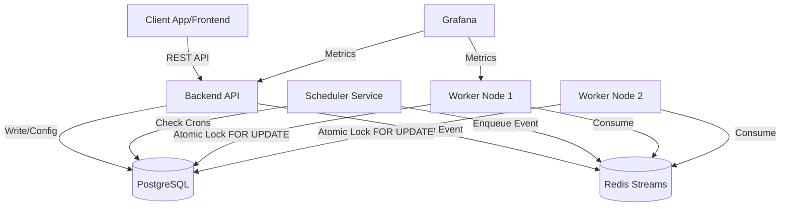
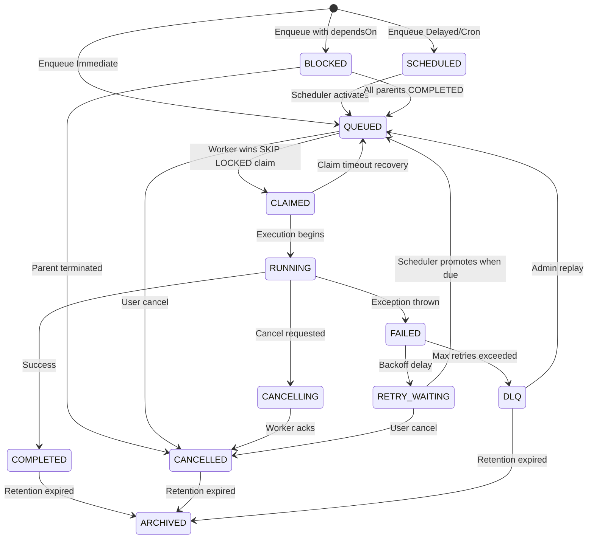
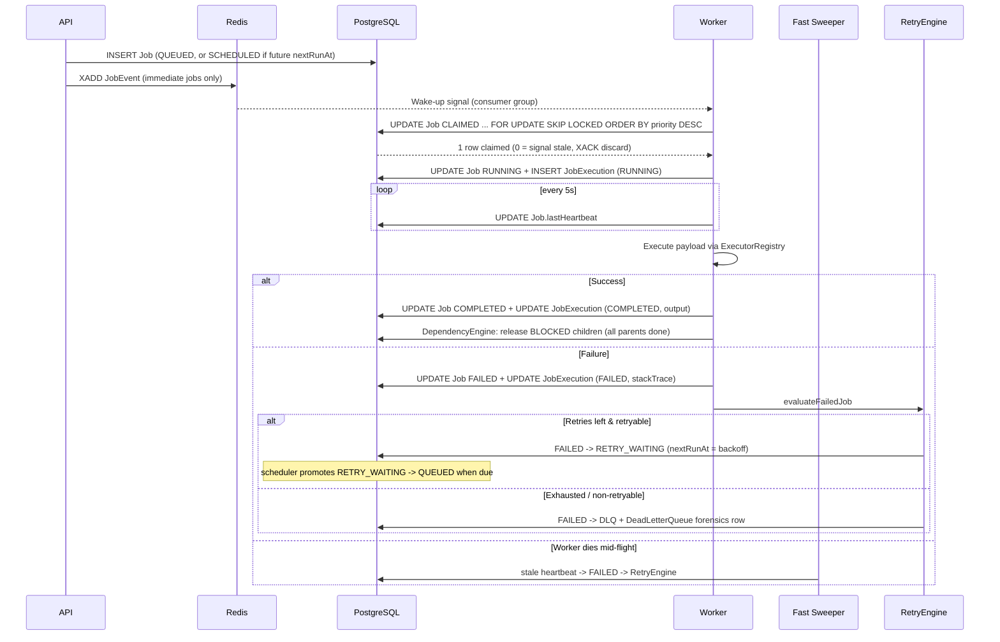
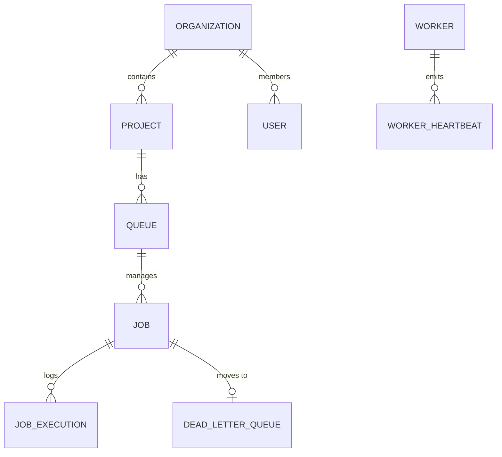

# High-Level Design (HLD) & Low-Level Design (LLD)

## High-Level Architecture
The system employs a Modular Monorepo architecture to maximize developer velocity while producing isolated, scalable deployment artifacts. 

The architecture consists of:
1. **Frontend**: React SPA deployed globally via edge networks (Vercel).
2. **Backend API**: Stateless Node.js/Express service exposing RESTful JSON endpoints.
3. **Scheduler**: Dedicated Node.js service evaluating cron expressions and moving scheduled jobs to the ready queue.
4. **Worker**: Independent Node.js service continuously polling Redis Streams and claiming jobs via PostgreSQL atomic locks.
5. **Datastore**: PostgreSQL (primary persistent state) and Redis (event bus, distributed locking, caching).

### Architecture Diagram (Mermaid)


## Low-Level Design

### Worker Claiming Mechanism (SKIP LOCKED)
Postgres is the source of truth; Redis Streams are only a wake-up channel.
1. API/scheduler writes the job row (`QUEUED`) and `XADD`s a wake-up entry to `queue:{queueId}`.
2. A worker in consumer group `djs_workers` `XREADGROUP`s the notification —
   the entry is a *signal*, not an assignment; its jobId is ignored.
3. Each poll tick also `XAUTOCLAIM`s pending stream entries idle > 30s,
   recovering wake-ups abandoned by crashed consumers.
4. The worker runs the authoritative claim — one atomic statement that picks
   the highest-priority QUEUED job:
   ```sql
   UPDATE "Job"
   SET status = 'CLAIMED', "lockedBy" = $workerId, "lockedAt" = NOW(), "updatedAt" = NOW()
   WHERE id = (
       SELECT id FROM "Job"
       WHERE status = 'QUEUED' AND "queueId" = $queueId
       ORDER BY priority DESC, "createdAt" ASC
       FOR UPDATE SKIP LOCKED
       LIMIT 1
   );
   ```
   No row returned → queue already drained (signal was stale); `XACK` and move on.
   A `JobExecutionHistory` row is written for the won claim.

Stale claims self-heal: a job stuck in `CLAIMED` past the queue's `claimTimeout`
(lockedAt-based) is re-queued and republished by the fast sweeper.

### Scheduler Batch Claim (SKIP LOCKED)
The scheduler promotes due jobs (`SCHEDULED`, `RETRY_WAITING` where
`nextRunAt <= NOW()`) inside a real transaction, so `FOR UPDATE SKIP LOCKED`
genuinely serializes replicas (autocommit would release locks on SELECT return):
```sql
SELECT id, "queueId", status FROM "Job"
WHERE status IN ('SCHEDULED','RETRY_WAITING') AND "nextRunAt" <= NOW()
ORDER BY "nextRunAt" ASC
LIMIT $batch
FOR UPDATE SKIP LOCKED;
-- then UPDATE ... SET status='QUEUED' + JobExecutionHistory rows, same tx;
-- XADD notification happens AFTER commit.
```
The cron materializer uses the same pattern on `ScheduledJob`: lock due
schedules, create a `QUEUED` Job row, roll `nextRunAt` forward via cron-parser.

### Recovery Sweeps
* **Fast sweep (~5s)**: CLAIMED past `claimTimeout` → QUEUED + republish;
  RUNNING with stale `lastHeartbeat` → FAILED → RetryEngine;
  unevaluated FAILED jobs → RetryEngine; stale workers → OFFLINE.
* **Slow sweep (~5min)**: republish drifted QUEUED notifications (dedup-safe
  via the claim CAS), purge metrics + worker heartbeats, archive terminal
  jobs past per-queue retention (`jobRetentionDays` / `dlqRetentionDays`).

### Dependency Gating (DAG)
Enqueue with `dependsOn: [parentJobId, ...]` creates the job in `BLOCKED` plus
`JobDependency` edges. Edges only ever point to pre-existing jobs, so cycles
are impossible by construction — no cycle detection needed.

* Worker success path calls `DependencyEngine.releaseDependents(jobId)`:
  each `BLOCKED` child whose parents are now all `COMPLETED` transitions
  `BLOCKED → QUEUED` and gets a fresh `XADD`.
* The fast sweeper runs `cancelOrphans()`: `BLOCKED` children of parents in
  `DLQ`/`CANCELLED`/`ARCHIVED` are cancelled — a DAG with a dead prerequisite
  can never run.
* Enqueue-time validation rejects missing parents (400) and already-dead
  parents (409); if all parents already completed, the child skips `BLOCKED`
  and enqueues directly.

### Job State Machine Diagram


### Sequence Diagram: Job Execution


### Entity-Relationship Diagram (ERD)

