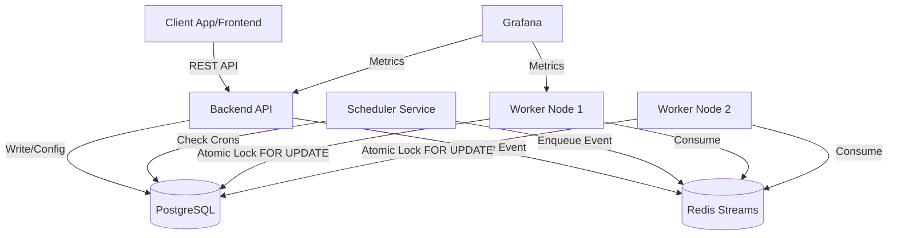
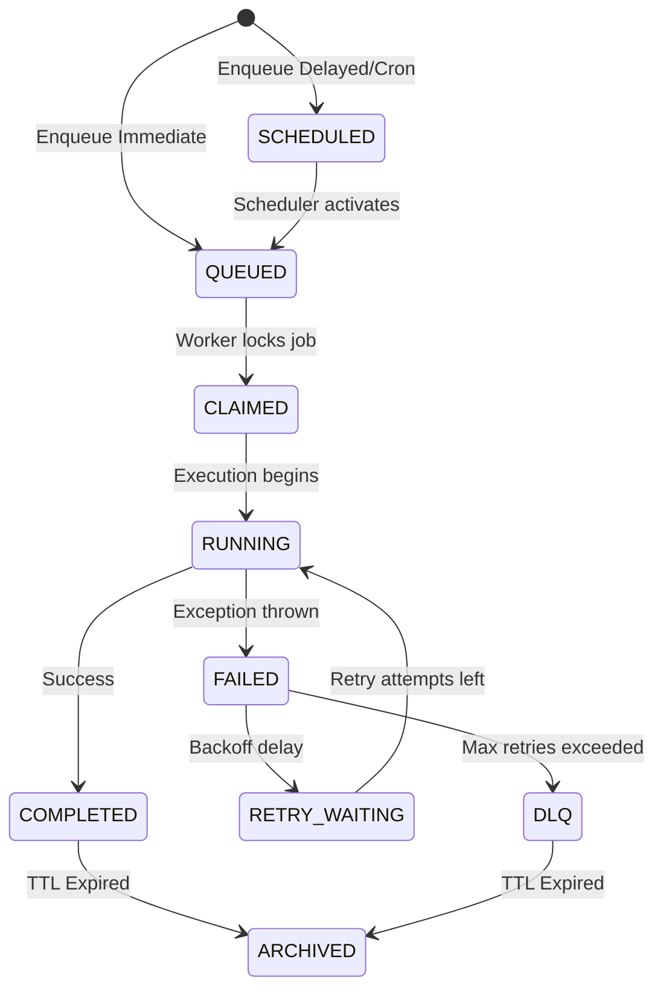
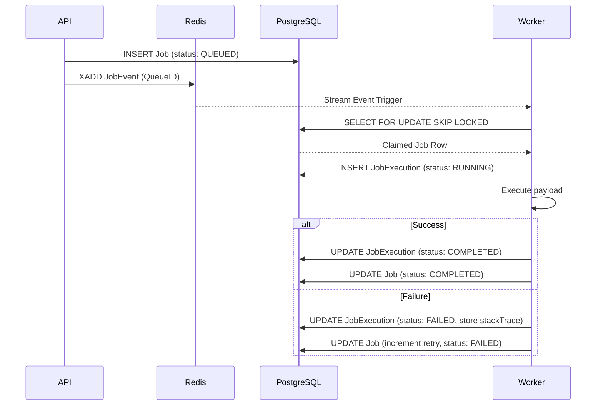
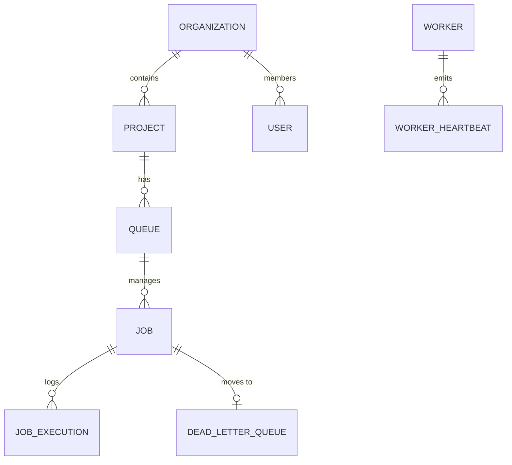

# High-Level Design (HLD) & Low-Level Design (LLD)

## High-Level Architecture
The system employs a Modular Monorepo architecture to maximize developer velocity while producing isolated, scalable deployment artifacts. 

The architecture consists of:
1. **Frontend**: React SPA deployed globally via edge networks (Vercel).
2. **Backend API**: Stateless Node.js/Express service exposing RESTful JSON endpoints.
3. **Scheduler**: Dedicated Node.js service evaluating cron expressions and moving scheduled jobs to the ready queue.
4. **Worker**: Independent Node.js service continuously polling Redis Streams and claiming jobs via PostgreSQL atomic locks.
5. **Datastore**: PostgreSQL (primary persistent state) and Redis (event bus, distributed locking, caching).

### Architecture Diagram (Mermaid)


## Low-Level Design

### Worker Claiming Mechanism (Atomic Locking)
To guarantee idempotent execution, the Worker service relies on a two-step claim process:
1. Receives notification of a pending job via Redis Stream.
2. Executes a Postgres transaction:
   ```sql
   UPDATE "Job"
   SET status = 'CLAIMED', "lockedAt" = NOW(), "lockedBy" = $1
   WHERE id = (
       SELECT id FROM "Job"
       WHERE status = 'QUEUED' AND "queueId" = $2
       ORDER BY priority DESC, "createdAt" ASC
       FOR UPDATE SKIP LOCKED
       LIMIT 1
   )
   RETURNING *;
   ```

### Job State Machine Diagram


### Sequence Diagram: Job Execution


### Entity-Relationship Diagram (ERD)

