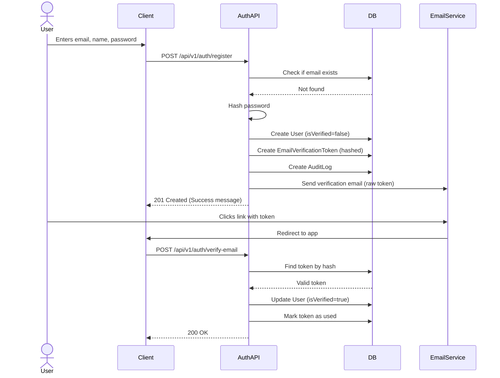
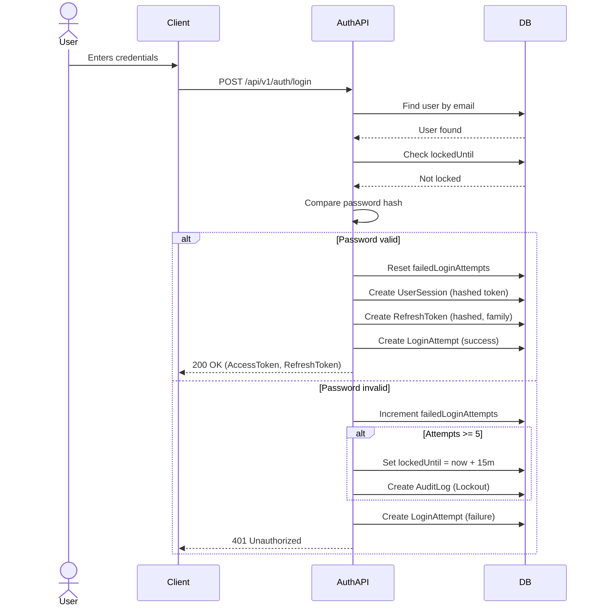
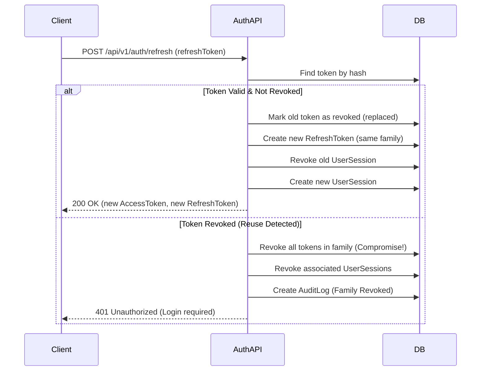
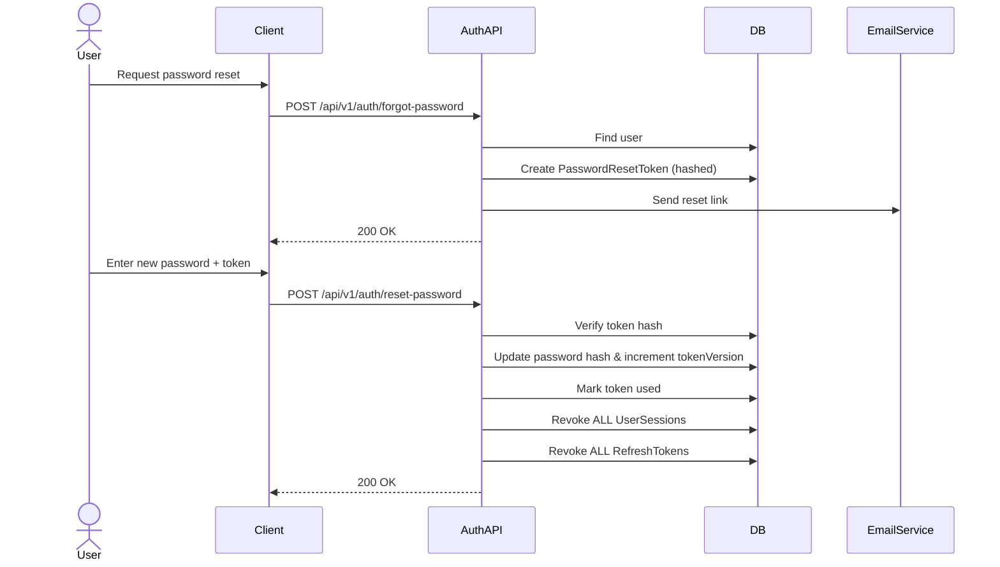
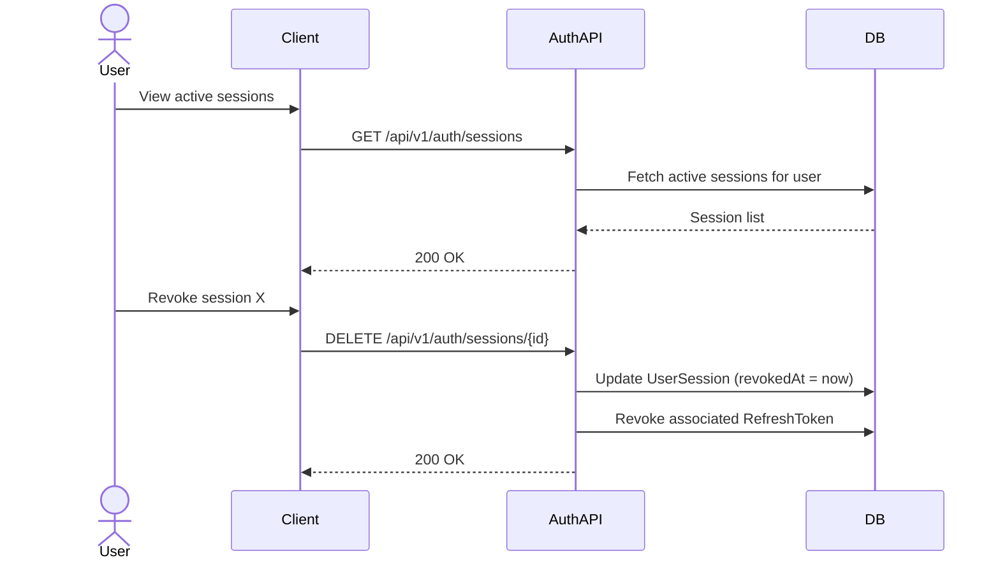

# Authentication Sequence Diagrams

## 1. Registration & Email Verification

## 2. Login Flow (Success & Lockout)

## 3. Token Refresh & Rotation

## 4. Password Reset

## 5. Session Revocation

